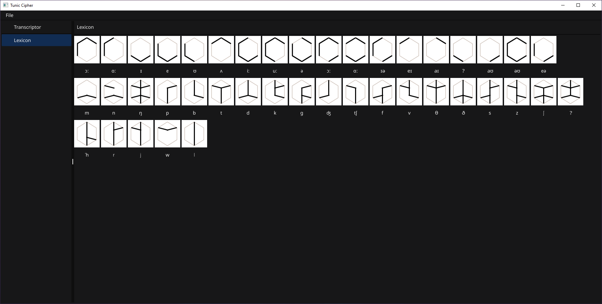

# Tunic Cipher

## Preamble

This project provides a tool for translating the custom language created for the game _Tunic_.

Warning: This tool contains **HEAVY** spoilers for the game. If you haven't played Tunic yet, I highly recommend doing so before using this tool. The game offers a beautiful experience, and the language is a significant part of its charm.

## Introduction

The Tunic Cipher is a tool designed to assist individuals in translating the custom language created for the game Tunic. It provides a user-friendly interface for selecting glyphs and instantly seeing their translations. Additionally, the tool allows users to save their queries, enabling them to easily resume their translation work between sessions.

## Features

- **Cipher Tool**: Easily select glyphs and instantly see their translations in the custom language of Tunic.

- **Query Saving**: Save your translation queries to maintain your progress and easily resume your work.

- **Lexicon Tab**: Access a comprehensive lexicon tab that provides a complete list of glyphs and their corresponding phonemes.

- **Dark Mode**: Switch between light and dark mode to suit your preferences.

